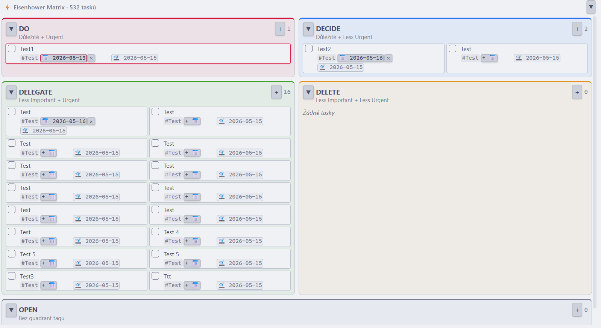
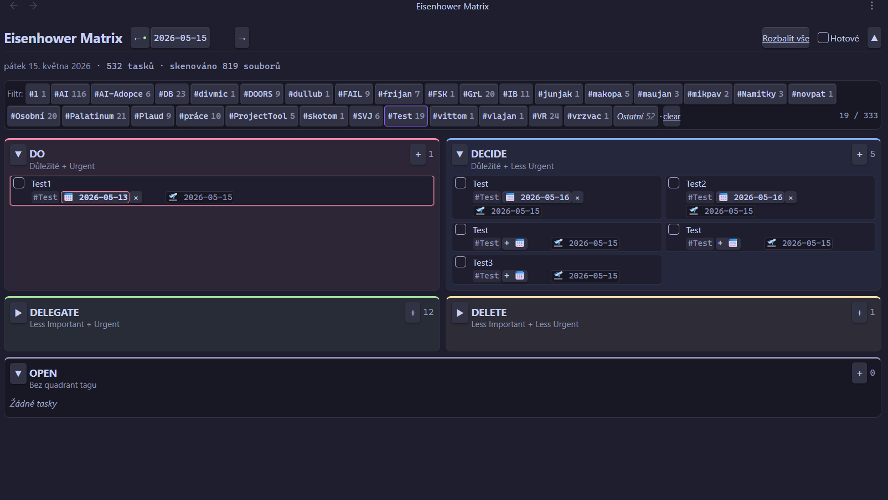

[English](README.md) · **Čeština**

# 4D Eisenhower Matrix — Obsidian plugin

Vizualizace tasků napříč celým vault-em v **5-polové Eisenhower matici** (DO / DECIDE / DELEGATE / DELETE / OPEN) + Kanban view. Čte a zapisuje [Obsidian Tasks](https://publish.obsidian.md/tasks/Introduction) syntaxi — `#tagy`, `📅 due`, `🛫 start`, `✅ done`, priority.

> Ranní dashboard pro rozhodnutí *co dělat teď*: ráno otevřu, vidím tasky rozdělené podle priority, odškrtnu hotové, případně přidám nové. Source-of-truth zůstávají MD soubory, plugin je jen vizuální vrstva nad nimi.






<p align="center"></p>

## Co to umí

| Funkce | Co dělá |
|--------|---------|
| **5-polová matice** | DO / DECIDE / DELEGATE / DELETE + záchytný **OPEN**. Kvadrant určuje první `#tag` za checkboxem (`#DO`, `#DECIDE`, `#DELEGATE`, `#DELETE`); cokoli jiného spadne do OPEN. |
| **Kanban zobrazení** | Rozbalí libovolný kvadrant na celou šířku se sloupci **To-do · In progress · Scheduled · Done**. Na desktopu drag karet mezi sloupci mění stav, na jiný kvadrant je přesune, nebo task rovnou přidáš do sloupce. Na mobilu/tabletu board scrolluje vodorovně a stav měníš přes menu karty (*Mark as…*). |
| **Cross-vault agregace** | Sbírá tasky ze **všech `.md` souborů** ve vaultu (Dataview-like), ne jen z dnešní daily note — jeden board nad celým druhým mozkem. |
| **6 stavů tasku** | Things-style `[ ]` to-do · `[/]` in progress · `[x]` done · `[-]` canceled · `[>]` forwarded · `[<]` scheduling. Každá karta má status box; libovolný stav nastavíš pravým klikem → *Mark as…*. |
| **Plné CRUD** | Přidání (text + tagy + due date + priorita), inline editace, odškrtnutí, přesun mezi kvadranty — vše se zapíše přímo do Markdownu. |
| **Priorita** | Obsidian Tasks konvence: 🔺 highest · ⏫ high · 🔼 medium · 🔽 low · ⏬ lowest. Zároveň páka na řazení — zvýším prioritu a task vyskočí nahoru. |
| **Due / start / done data** | Čte a zapisuje `📅 due`, `🛫 start`, `✅ done`. Overdue tasky jsou zvýrazněné a plavou nahoru ve svém kvadrantu. |
| **Markdown v textu tasku** | Inline **tučné**, *kurzíva*, `kód`, ~~přeškrtnuté~~; úvodní `#`…`######` vykreslí task jako nadpis. |
| **Tag autocomplete** | Při psaní napovídá existující tagy z vault-u, ať netvoříš skoro-duplicity. |
| **Filtr podle tagu** | Context-tag chipy ve filter baru (multi-select, OR logika) + virtuální „Other" chip pro tasky bez tagu. |
| **Rychlé filtry podle due date** | Tlačítka **Today** (overdue + due dnes) a **This week** (overdue + 7 dní dopředu) na začátku filter baru, opticky odlišená oranžovou. |
| **Datum navigace** | ← / → / kalendář / Dnes + den-cutoff banner po půlnoci s nabídkou skoku na dnešek. |
| **Undo grace period** | 3sekundové okno se zeleným odpočtem po odškrtnutí/zrušení tasku — klik znovu = vrátit. |
| **Kompaktní režim** | Přepínač v hlavičce zmenší každou kartu na dva řádky (text + priorita/due date) pro hustší přehled. |
| **Zobrazit / skrýt hotové** | Přepínač „Done" odhalí nebo skryje hotové tasky (`[x]` + `[-]`); počítadlo tasků se přizpůsobí. |
| **Sbalitelné UI** | Sbal jednotlivé kvadranty nebo celou hlavičku pro víc místa — užitečné na mobilu. |
| **Deterministické řazení** | V kvadrantu: overdue → priorita → due date → abecedně. Žádné nechtěné přeskupení dragem. |
| **Daily note integrace** | Nové tasky jdou pod **konfigurovatelný nadpis sekce**; pokud dnešní daily note chybí, vytvoří se automaticky podle tvého core „Daily notes" template (`{{date}}`, `{{title}}`, `{{time}}`). |
| **Vyloučené složky** | Odkloní matici od šablon, archivů nebo čehokoli, co nechceš skenovat. |
| **Desktop i mobil** | Funguje na desktopu i Androidu (`isDesktopOnly: false`); responzivní layout s ovládáním pro dotyk. |
| **Theme-aware** | Postavené čistě na Obsidian CSS proměnných — přizpůsobí se světlému/tmavému theme i accent barvě. |

## Instalace

**Settings → Community plugins → Browse → vyhledej „4D Eisenhower Matrix" → Install → Enable.**

Pak otevři přes ribbon ikonu (mřížka v levém panelu) nebo command palette → *Open matrix*.

## Syntaxe tasků

Plugin čte/zapisuje běžnou Obsidian Tasks syntaxi:

```markdown
- [ ] #DO #Osobní ⏫ 📅 2026-05-20 🛫 2026-05-15 Důležitý call s Alicí
- [x] #DECIDE Dlouhodobé plánování ✅ 2026-05-10
- [ ] task bez quadrant tagu  ← spadne do OPEN kvadrantu
```

Kvadrantové tagy (první token po `- [ ]`):

| Tag | Kvadrant | Význam |
|-----|----------|--------|
| `#DO` | 🔴 DO | Důležité + Urgentní |
| `#DECIDE` | 🔵 DECIDE | Důležité + Méně urgentní |
| `#DELEGATE` | 🟢 DELEGATE | Méně důležité + Urgentní |
| `#DELETE` | 🟡 DELETE | Méně důležité + Méně urgentní |
| *(jiný / žádný)* | ⚫ OPEN | Nezařazené |

Priorita ([Obsidian Tasks konvence](https://publish.obsidian.md/tasks/Getting+Started/Priorities)):

| Emoji | Úroveň |
|-------|--------|
| 🔺 | Nejvyšší |
| ⏫ | Vysoká |
| 🔼 | Střední |
| 🔽 | Nízká |
| ⏬ | Nejnižší |

## Ovládání

| Akce | Jak |
|------|-----|
| Odškrtnout task | Klik na checkbox · 3 s grace period (klik znovu = vrátit) |
| Přidat task | Klik `+` v headeru kvadrantu → text + #tagy + 📅 + ⏫ → Enter |
| Editovat task | **Desktop:** dvojklik na kartu. **Mobil:** long-press / dvojklep → menu → „Edit" |
| Změnit termín samostatně | Klik na 📅 badge na kartě |
| Přesun mezi kvadranty | **Desktop:** drag karty na cílový kvadrant. **Mobil:** long-press / dvojklep → menu → „Move to…" |
| Otevřít source soubor | **Desktop:** pravý klik na kartu. **Mobil:** long-press / dvojklep. → menu (current pane / nová záložka / split / okno) — kurzor přistane na řádku tasku |
| Filtr podle tagu | Klik na chip ve filter baru (multi-select OR) |
| Rychlý filtr podle due date | Tlačítka **Today** (overdue + due dnes) / **This week** (overdue + 7 dní) na začátku filter baru |
| Předchozí / další den | Šipky ← → v headeru, kalendář, nebo „Dnes" |
| Sbalit kvadrant | Klik na šipku ▼/▶ vedle názvu kvadrantu |
| Sbalit celou hlavičku | ▲ vpravo nahoře (užitečné na mobilu) |
| Zobrazit hotové tasky | Toggle „Done" v headeru |
| Kompaktní zobrazení | Přepínač „Compact" v headeru — 2řádkové karty |
| Změnit stav tasku | Pravý klik na kartu (nebo na status box) → *Mark as…* |
| Kanban zobrazení | Klik na kanban ikonu v hlavičce kvadrantu → status sloupce; další klik zpět na mřížku. Na mobilu/tabletu sloupce scrollují vodorovně; stav karty změníš přes její menu (*Mark as…*) |

### Pořadí v kvadrantu

Deterministické, nelze ručně přeskupit:
1. **Overdue** (📅 < dnes) — nahoře
2. **Priorita desc** — 🔺 → ⏫ → 🔼 → 🔽 → ⏬ → bez priority
3. **Due date asc** — nejbližší termín první
4. **Alfabeticky** podle textu

Manuální páka přeskupování je **priorita** — nastav ji a task se vyhoupne nahoru.

## Nastavení

`Settings → 4D Eisenhower Matrix`:

- **Daily folder** — kam ukládat nové daily notes. Prázdné = respektuj core plugin „Daily notes" config. Override = vlastní cesta (s folder suggesterem).
- **Daily section heading** — nadpis v daily note, pod který se čtou a přidávají dnešní tasky. Výchozí: `# Today`. Nastav podle toho, co používáš (např. `# Dnes`, `## Úkoly`).
- **Vyloučené složky** — tasky z těchto složek se ignorují. Výchozí: žádné — vyloučené složky si nastav sám. UI s + / × tlačítky a folder suggesterem.

## Daily note integrace

Plugin hledá v daily souboru konfigurovatelný nadpis sekce (nastavuje se v **Settings → Daily section heading**, výchozí `# Today`). Nové tasky vkládá pod tuto sekci.

Pokud daily note pro daný den neexistuje a přidáš první task, plugin ji **vytvoří automaticky**:
1. Pokud má core plugin „Daily notes" nastavený **template**, použije ho (s expanzí `{{date}}`, `{{title}}`, `{{time}}`)
2. Jinak fallback na minimální scaffold (frontmatter + nastavený nadpis sekce)

## Mobile

Funguje na Androidu (`isDesktopOnly: false`; iOS nezkoušeno, ale mělo by fungovat).

- **Long-press nebo dvojklep** na kartu → context menu (Edit · Open file · **Move to…**)
- **Přesun mezi kvadranty** se na mobilu dělá přes menu („Přesunout → DECIDE" atd.). Touch-drag je v Obsidian mobile webview nespolehlivý, proto menu — dva klepy, deterministické.
- **Sbalená hlavička** (▲ tlačítko) — uvolní vertikální místo pro matici

## Roadmap

- [ ] Quick-add task přes Command Palette (bez otvírání view)
- [ ] Klávesové zkratky uvnitř view (J/K navigace, X toggle, N nový task)
- [ ] Plný moment.js syntax v daily templatech (zatím jen `{{date}}`/`{{title}}`/`{{time}}`)

Něco postrádáš? [Issue na GitHubu](https://github.com/krcaljaroslav/4D-eisenhower-matrix/issues).

## Známé limity

- Manuální pořadí napříč soubory (jeden task v daily, jiný v projektu) není podporováno — sort je deterministický.

## Bugs / přispívání

[Issues](https://github.com/krcaljaroslav/4D-eisenhower-matrix/issues) · Pull requesty vítané.

## Changelog

**1.0.23** — Změněn výchozí **Daily section heading** z `# Dnes` na `# Today`. Dotkne se jen čistých instalací / uživatelů, kteří si nikdy nenastavili vlastní — existující konfigurace si svou hodnotu nechá.

<details>
<summary>Starší verze</summary>

- **1.0.22** — Kanban zobrazení je teď dostupné i na **mobilu a tabletu**, nejen na desktopu. Status sloupce scrollují vodorovně (swipe mezi nimi); protože touch-drag je v Obsidian mobilním webview nespolehlivý, stav karty měníš přes její menu (*Mark as…*) — karta naskočí do odpovídajícího sloupce.

- **1.0.21** — Úklid lintu pro store review: async handlery obaleny `void`, přepnuto na `activeDocument` / `activeWindow` kvůli popout oknům, odstraněna nadbytečná type assertion, popsán zbývající direktivní komentář. Bez dopadu na uživatele. (Tři deprecation *recommendations* nechány — náhrady nejsou dostupné při `minAppVersion` 1.8.0.)

- **1.0.20** — Opravy kvůli automatické kontrole Obsidian store: zvýšen `minAppVersion` na 1.8.0, doplněny popisky ke dvěma `eslint-disable` direktivám, `onunload` převeden na synchronní.

- **1.0.19** — Doladěný design due-filter tlačítek: vybrané teď jasně vyniká (oranžová výplň + ohraničení), nevybrané se odlišuje jen oranžovým textem.

- **1.0.18** — Rychlé filtry podle due date: tlačítka **Today** (overdue + due dnes) a **This week** (overdue + 7 dní) na začátku filter baru, opticky odlišená oranžovou.
- **1.0.13–1.0.17** — Kanban zobrazení (desktop): přepnutí kvadrantu do sloupců To-do / In progress / Scheduled / Done, drag pro změnu stavu i přesun kvadrantu, přidávání tasků po sloupcích, tlačítko „Back to grid".
- **1.0.7–1.0.12** — Šest Things-style stavů tasku s vlastním status boxem, Markdown nadpisy v textu, půlený čtverec pro „in progress", ovládání ve sbalené hlavičce.
- **1.0.6** — Inline Markdown v textu tasku + kompaktní 2řádkový režim.
- **1.0.0** — První release: 5-polová matice, cross-vault agregace, CRUD, priorita, tag autocomplete, filtry, data, grace period, daily-note integrace.

</details>

## Licence

[MIT](LICENSE)
