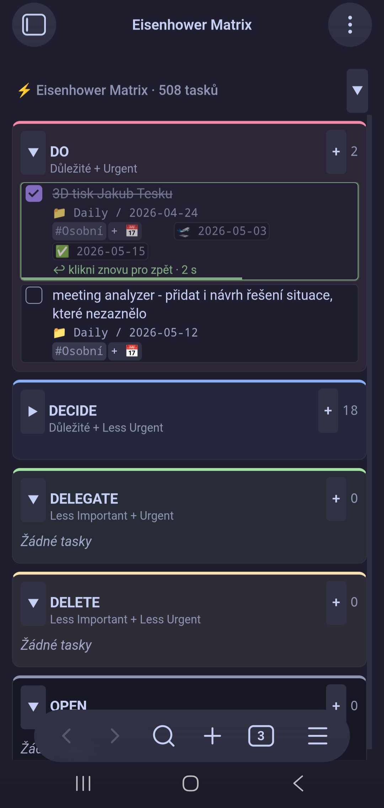

[English](README.md) · **Čeština**

# Eisenhower Matrix — Obsidian plugin

Vizualizace tasků napříč celým vault-em v **5-polové Eisenhower matici** (DO / DECIDE / DELEGATE / DELETE / OPEN). Čte a zapisuje [Obsidian Tasks](https://publish.obsidian.md/tasks/Introduction) syntaxi — `#tagy`, `📅 due`, `🛫 start`, `✅ done`, priority emoji.

> Ranní dashboard pro rozhodnutí *co dělat teď*: ráno otevřu, vidím tasky rozdělené podle priority, odškrtnu hotové, případně přidám nové. Source-of-truth zůstávají MD soubory, plugin je jen vizuální vrstva nad nimi.

<table>
  <tr>
    <td></td>
    <td></td>
  </tr>
  <tr>
    <td colspan="2" align="center">
      
    </td>
  </tr>
</table>

## Co to umí

- **5-polová matice** — kvadrant určuje **první `#tag`** za checkboxem: `#DO`, `#DECIDE`, `#DELEGATE`, `#DELETE`. Cokoli jiného → OPEN.
- **Cross-vault agregace** — sbírá tasky ze **všech `.md` souborů** ve vaultu (Dataview-like), ne jen z dnešní daily note.
- **Plné CRUD** — přidání (formulář s text + tagy + due date + priorita), editace, odškrtnutí, přesun mezi kvadranty.
- **Priorita** podle Obsidian Tasks konvence: 🔺 highest · ⏫ high · 🔼 medium · 🔽 low · ⏬ lowest
- **Tag autocomplete** — při psaní tagů napovídá existující tagy z vault-u (žádné duplicity)
- **Filtr** podle context tagu (OR logika + virtuální „Ostatní" chip)
- **Datum navigace** (← / → / kalendář / Dnes) + den-cutoff banner po půlnoci
- **3 s grace period** po odškrtnutí (zelený rámeček + odpočet — klikni znovu pro vrácení)
- **Sticky header** + sbalitelná hlavička pro mobilní zobrazení
- **Sortování v kvadrantu**: overdue → priorita desc → due date asc → alfabeticky
- **Desktop i mobil** (Android testováno)
- **Respektuje core „Daily notes"** — folder + template (s `{{date}}`, `{{title}}`, `{{time}}` substitucí)

## Instalace

### Přes BRAT (doporučeno)

[BRAT](https://github.com/TfTHacker/obsidian42-brat) je Obsidian community plugin pro instalaci pluginů přímo z GitHubu (s auto-update).

1. Settings → Community plugins → Browse → vyhledej **BRAT** → Install + Enable
2. `Ctrl+P` (na mobilu: 3 tečky → Command palette) → **„BRAT: Add a beta plugin for testing"**
3. Vlož URL: `https://github.com/krcaljaroslav/4D-eisenhower-matrix`
4. Add Plugin
5. Settings → Community plugins → enable **Eisenhower Matrix**
6. Otevři přes ribbon ikonu (mřížka v levém panelu) nebo `Ctrl+P` → „Open Eisenhower Matrix"

Update se objeví automaticky do 15 minut po vydání nového [releasu](https://github.com/krcaljaroslav/4D-eisenhower-matrix/releases). Nebo manuálně přes `BRAT: Check for updates to all beta plugins`.

### Manuálně (bez BRAT)

Stáhni `main.js`, `manifest.json`, `styles.css` z [posledního releasu](https://github.com/krcaljaroslav/4D-eisenhower-matrix/releases/latest) a hoď je do `<vault>/.obsidian/plugins/4d-eisenhower-matrix/`. Pak Settings → Community plugins → enable.

## Syntaxe tasků

Plugin čte/zapisuje běžnou Obsidian Tasks syntaxi:

```markdown
- [ ] #DO #Osobní ⏫ 📅 2026-05-20 🛫 2026-05-15 Důležitý call s Alicí
- [x] #DECIDE Dlouhodobé plánování ✅ 2026-05-10
- [ ] task bez quadrant tagu  ← spadne do OPEN kvadrantu
```

Kvadrantové tagy (první token po `- [ ]`):

| Tag | Kvadrant | Význam |
|-----|----------|--------|
| `#DO` | 🔴 DO | Důležité + Urgentní |
| `#DECIDE` | 🔵 DECIDE | Důležité + Méně urgentní |
| `#DELEGATE` | 🟢 DELEGATE | Méně důležité + Urgentní |
| `#DELETE` | 🟡 DELETE | Méně důležité + Méně urgentní |
| *(jiný / žádný)* | ⚫ OPEN | Nezařazené |

Priorita ([Obsidian Tasks konvence](https://publish.obsidian.md/tasks/Getting+Started/Priorities)):

| Emoji | Úroveň |
|-------|--------|
| 🔺 | Nejvyšší |
| ⏫ | Vysoká |
| 🔼 | Střední |
| 🔽 | Nízká |
| ⏬ | Nejnižší |

## Ovládání

| Akce | Jak |
|------|-----|
| Odškrtnout task | Klik na checkbox · 3 s grace period (klik znovu = vrátit) |
| Přidat task | Klik `+` v headeru kvadrantu → text + #tagy + 📅 + ⏫ → Enter |
| Editovat task | **Desktop:** dvojklik na kartu. **Mobil:** long-press / dvojklep → menu → Editovat |
| Změnit termín samostatně | Klik na 📅 badge na kartě |
| Přesun mezi kvadranty | **Desktop:** drag karty na cílový kvadrant. **Mobil:** long-press / dvojklep → menu → „Přesunout do…" |
| Otevřít source soubor | **Desktop:** pravý klik na kartu. **Mobil:** long-press / dvojklep. → menu (current pane / nová záložka / split / okno) — kurzor přistane na řádku tasku |
| Filtr podle tagu | Klik na chip ve filter baru (multi-select OR) |
| Předchozí / další den | Šipky ← → v headeru, kalendář, nebo „Dnes" |
| Sbalit kvadrant | Klik na šipku ▼/▶ vedle názvu kvadrantu |
| Sbalit celou hlavičku | ▲ vpravo nahoře (užitečné na mobilu) |
| Zobrazit hotové tasky | Toggle „Hotové" v headeru |

### Pořadí v kvadrantu

Deterministické, nelze ručně přeskupit:
1. **Overdue** (📅 < dnes) — nahoře
2. **Priorita desc** — 🔺 → ⏫ → 🔼 → 🔽 → ⏬ → bez priority
3. **Due date asc** — nejbližší termín první
4. **Alfabeticky** podle textu

Manuální páka přeskupování je **priorita** — nastav ji a task se vyhoupne nahoru.

## Nastavení

`Settings → Eisenhower Matrix`:

- **Daily folder** — kam ukládat nové daily notes. Prázdné = respektuj core plugin „Daily notes" config. Override = vlastní cesta (s folder suggesterem).
- **Vyloučené složky** — tasky z těchto složek se ignorují. Default `_templates`, `1_Agents`. UI s + / × tlačítky a folder suggesterem.

## Daily note integrace

Plugin hledá v daily souboru sekci `# Dnes`. Nové tasky vkládá pod tuto sekci.

Pokud daily note pro daný den neexistuje a přidáš první task, plugin ji **vytvoří automaticky**:
1. Pokud má core plugin „Daily notes" nastavený **template**, použije ho (s expanzí `{{date}}`, `{{title}}`, `{{time}}`)
2. Jinak fallback na minimální scaffold (frontmatter + `# Dnes` heading)

> Aktuálně je hardcoded heading `# Dnes` (česky). Pokud chceš jiný (např. `# Today`), [otevři issue](https://github.com/krcaljaroslav/4D-eisenhower-matrix/issues) — udělám konfigurovatelné.

## Mobile

Funguje na Androidu (`isDesktopOnly: false`; iOS nezkoušeno, ale mělo by fungovat).

- **Long-press nebo dvojklep** na kartu → context menu (Editovat · Otevřít soubor · **Přesunout do…**)
- **Přesun mezi kvadranty** se na mobilu dělá přes menu („Přesunout → DECIDE" atd.). Touch-drag je v Obsidian mobile webview nespolehlivý, proto menu — dva klepy, deterministické.
- **Sbalená hlavička** (▲ tlačítko) — uvolní vertikální místo pro matici

## Roadmap

- [ ] Konfigurovatelný heading sekce (`# Dnes` → user choice)
- [ ] Quick-add task přes Command Palette (bez otvírání view)
- [ ] Klávesové zkratky uvnitř view (J/K navigace, X toggle, N nový task)
- [ ] Plný moment.js syntax v daily templatech (zatím jen `{{date}}`/`{{title}}`/`{{time}}`)
- [ ] Anglická lokalizace UI (zatím česky)

Něco postrádáš? [Issue na GitHubu](https://github.com/krcaljaroslav/4D-eisenhower-matrix/issues).

## Známé limity

- UI je momentálně **česky** (Sbalit vše, Hotové, Žádné tasky, atd.). Anglická lokalizace je na roadmap.
- Daily heading je hardcoded `# Dnes`.
- Manuální pořadí napříč soubory (jeden task v daily, jiný v projektu) není podporováno — sort je deterministický.

## Bugs / přispívání

[Issues](https://github.com/krcaljaroslav/4D-eisenhower-matrix/issues) · Pull requesty vítané.

## Licence

[MIT](LICENSE)
